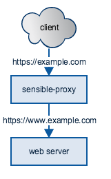

# Sensible Proxy

Sensible proxy acts as a HTTP/HTTPS proxy that steers all incoming traffic
to the www sub domain of the requested domain.

## Theory of operation

When using cloud providers it is very common that they will give you a DNS CNAME
to a load balancer for high availability. Apex domains on the other hand should
always point to a static IP address. Multiple DNS providers allows you to setup
an "ALIAS" record that works around this restriction, but for those without this
functionality, sensible proxy was created.

Sensible proxy looks at the incoming HTTP(S) connection, finds the requested
domain and negotiates a connection to the web server listening on the www domain.
If the connection is successful, it will act as the middle man, by copying
traffic between the client and the web server.

For HTTPS traffic, sensible proxy relies on the Server Name Indication (SNI) TLS
extension. This means you don't need an SSL certificate configured on the proxy
itself for it to work.

All modern and popular browsers provide the hostname in the SNI header.

## Configuration

Sensible proxy can be started without any configuration, but can be customised
via environment variables.

`HTTP_PORT` default: 80

Listening port to receive HTTP traffic.

`HTTPS_PORT` default: 443

Listening port to receive HTTPS traffic

`LOG_PATH` default: /var/log/sensible-proxy.log

Where to log ACCESS and ERRORS for traffic. Sensible-proxy will output
application error and info (startup and shutdown messages) to STDOUT.

`WHITELIST_URL` default: disabled

If `WHITELIST_URL` is set, sensible-proxy will fetch a list of domains every
minute. The domains listed on that URL are the only ones allowed to be proxied.

The domains must be newline separated and encoded with SHA1. If a line can't
be decoded as a SHA1, it will be ignored.

If there are any problem with fetching the list it will disable the whitelist.

## Thanks

Sensible Proxy is derived from https://github.com/gpjt/stupid-proxy which showed
us how to unpick the TLS protocol to get the domain from the SNI header.
